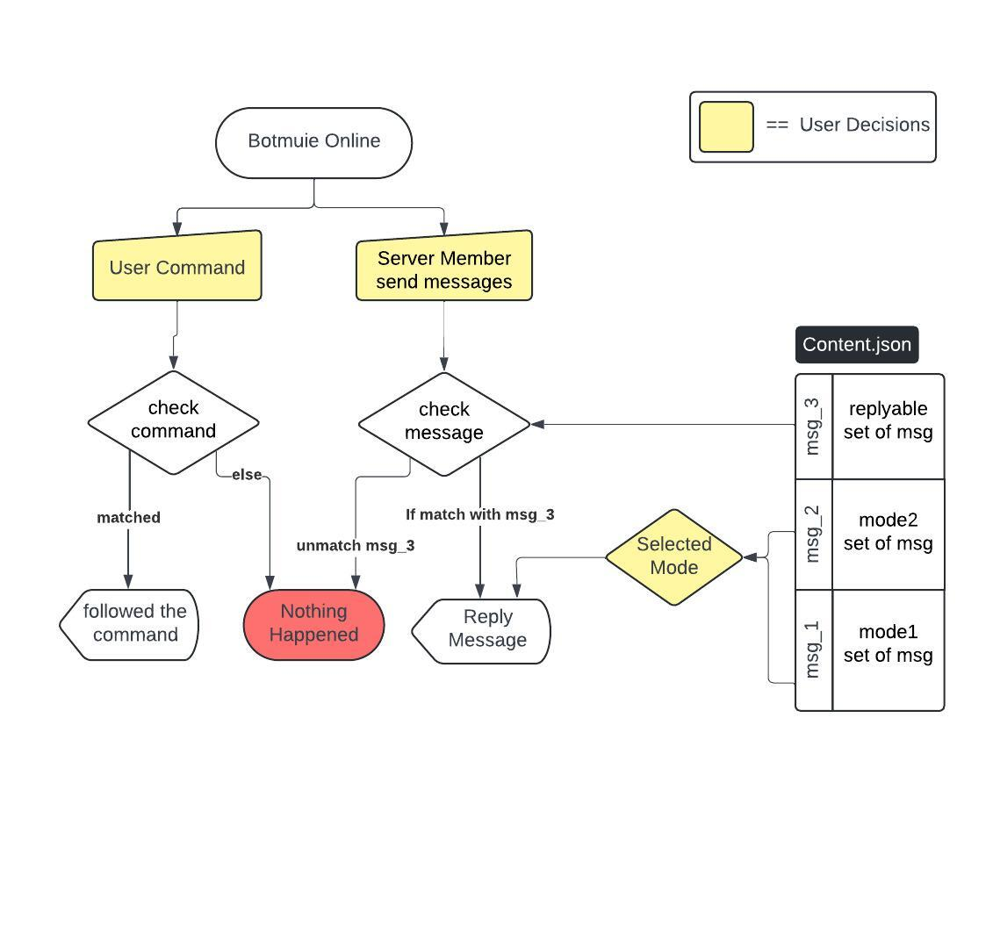
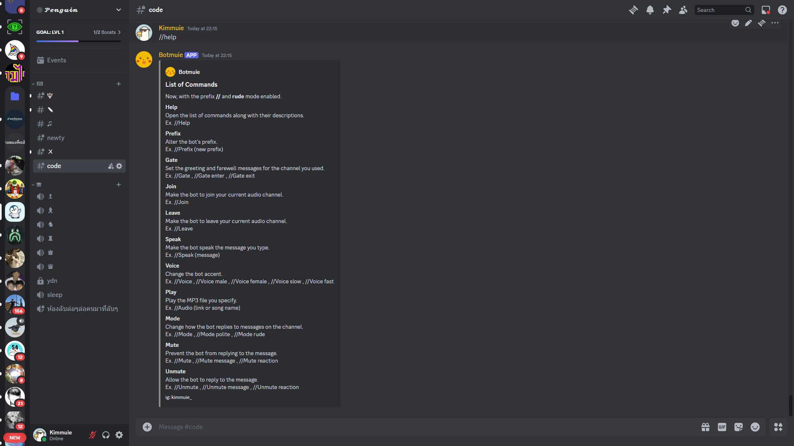
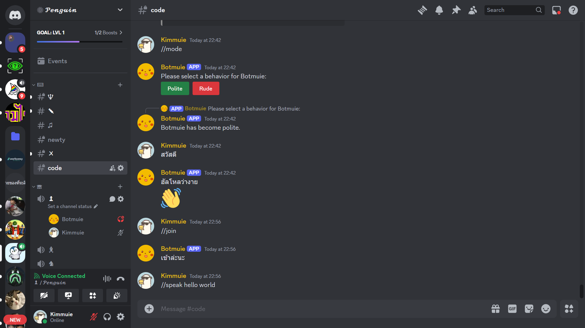

# Botmuie

### What is Botmuie?
**Botmuie** is a Discord bot that has many features, for instance, open music, reply to messages, and speak from the command. This bot can reply only in Thai because it has been only used on my server with my friends to be a funny and annoying thing on the server. However, this bot isn't always online because it requires money for hosting. It is only online since I host it with my laptop.
   
**Botmuie** คือบอท Discord ที่มีหลายฟีเจอร์ด้วยกัน เช่น เปิดเพลง ตอบข้อความ และพูดคำสั่ง บอทตัวนี้ตอบกลับได้เฉพาะภาษาไทยเท่านั้น เพราะมันถูกใช้งานแค่บนเซิร์ฟเวอร์ของผมกับเพื่อน เพื่อที่จะเป็นสีสันบนเซิร์ฟเวอร์ของผม แต่อย่างไรก็ตามบอทตัวนี้ไม่ได้ออนไลน์ตลอดเวลาเพราะต้องเสียเงินในการโฮสต์ มันออนไลน์ก็ต่อเมื่อผมเปิดโฮสต์มันด้วยแล็ปท็อปของผมเท่านั้นนะครับ
 
 
 
### Method
This bot has set the standard prefix as "//".  Any user can command it using //. By the way, there are command lists using //help, which will show all commands and how to use them.
   
บอทนี้ตั้งค่าคำนำหน้าเป็น "//" โดยที่ผู้ใช้ทุกคนสามารถสั่งงานโดยใช้ // นอกจากนี้ยังมีรายการคำสั่งด้วย โดยวิธีเปิดดูเพียงแค่พิมพ์ว่า //help ซึ่งมันจะแสดงคำสั่งทั้งหมดและวิธีใช้
 
 
 

### Used Language/Tools

  &nbsp;

   

If anyone wants to invite Botmuie to your Discord server, you can use [Botmuie Invitation Link](https://discord.com/api/oauth2/authorize?client_id=1208700289948065845&permissions=8&scope=bot), by the way bot isn't always online.

### Flowchart 

  

   

### Demo Command

  
  
  
  

